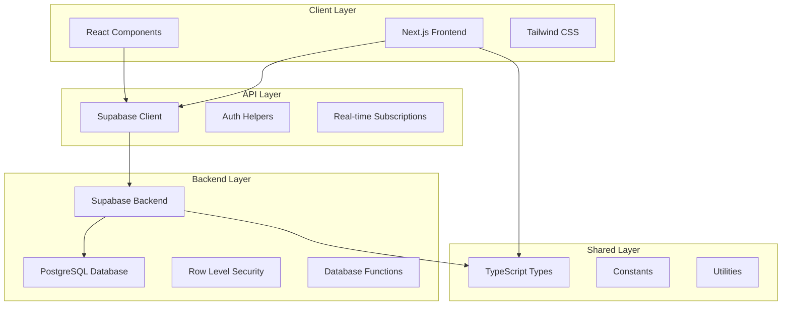

# Design Document

## Overview

Система "Банк Желаний" представляет собой современное веб-приложение, построенное на архитектуре клиент-сервер с использованием Next.js для фронтенда и Supabase в качестве Backend-as-a-Service. Приложение реализует игровую механику управления желаниями с трехуровневой валютной системой, социальными функциями и системой достижений.

Основные принципы дизайна:
- **Модульность**: Четкое разделение на фронтенд, бэкенд и общие компоненты
- **Масштабируемость**: Возможность легкого добавления новых валют и механик
- **Безопасность**: Row Level Security (RLS) для защиты данных пользователей
- **Производительность**: Оптимизированные запросы и индексы базы данных
- **UX-ориентированность**: Интуитивный интерфейс с игровыми элементами

## Architecture

### High-Level Architecture



### Technology Stack

**Frontend:**
- Next.js 14 с App Router для современной архитектуры
- React 18 для компонентной архитектуры
- Tailwind CSS для быстрой стилизации
- TypeScript для типобезопасности
- Lucide React для иконок

**Backend:**
- Supabase как Backend-as-a-Service
- PostgreSQL для надежного хранения данных
- Row Level Security для безопасности
- Database Functions для бизнес-логики
- Real-time subscriptions для живых обновлений

**Shared:**
- TypeScript типы для консистентности
- Общие константы и утилиты
- Валидационные схемы

## Components and Interfaces

### Core Components

#### 1. Authentication System
**Компонент:** `AuthProvider`
- Управляет состоянием аутентификации
- Интегрируется с Supabase Auth
- Предоставляет контекст пользователя

**Интерфейсы:**
```typescript
interface AuthContext {
  user: User | null
  signIn: (email: string, password: string) => Promise<void>
  signUp: (email: string, password: string, username: string) => Promise<void>
  signOut: () => Promise<void>
  loading: boolean
}
```

#### 2. Wallet Management System
**Компонент:** `WalletProvider`
- Управляет состоянием кошелька пользователя
- Обрабатывает конвертацию валют
- Синхронизируется с базой данных в реальном времени

**Интерфейсы:**
```typescript
interface WalletContext {
  wallet: Wallet | null
  convertCurrency: (from: CurrencyType, to: CurrencyType, amount: number) => Promise<boolean>
  transferCurrency: (toUserId: string, currency: CurrencyType, amount: number) => Promise<boolean>
  refreshWallet: () => Promise<void>
}
```

#### 3. Wish Management System
**Компонент:** `WishProvider`
- Управляет CRUD операциями с желаниями
- Обрабатывает фильтрацию и поиск
- Управляет статусами желаний

**Интерфейсы:**
```typescript
interface WishContext {
  wishes: Wish[]
  createWish: (wish: CreateWishRequest) => Promise<Wish>
  updateWishStatus: (wishId: string, status: WishStatus, assigneeId?: string) => Promise<void>
  disputeWish: (wishId: string, comment: string) => Promise<void>
  filterWishes: (filter: WishFilter) => Wish[]
}
```

#### 4. Social System
**Компонент:** `SocialProvider`
- Управляет системой друзей
- Обрабатывает запросы в друзья
- Управляет уведомлениями

**Интерфейсы:**
```typescript
interface SocialContext {
  friends: User[]
  friendRequests: Friendship[]
  sendFriendRequest: (userId: string) => Promise<void>
  acceptFriendRequest: (requestId: string) => Promise<void>
  rejectFriendRequest: (requestId: string) => Promise<void>
}
```

### UI Components

#### 1. Layout Components
- `AppLayout`: Основной лейаут приложения
- `Navigation`: Навигационное меню
- `Sidebar`: Боковая панель с быстрыми действиями

#### 2. Feature Components
- `WalletCard`: Отображение баланса кошелька
- `WishCard`: Карточка желания
- `WishList`: Список желаний с фильтрацией
- `CreateWishModal`: Модальное окно создания желания
- `TransactionHistory`: История транзакций
- `AchievementBadge`: Значок достижения

#### 3. Form Components
- `WishForm`: Форма создания/редактирования желания
- `CurrencyConverter`: Компонент конвертации валют
- `FriendSearch`: Поиск и добавление друзей

## Data Models

### Database Schema

#### Users Table
```sql
CREATE TABLE public.users (
    id UUID PRIMARY KEY REFERENCES auth.users(id),
    email TEXT UNIQUE NOT NULL,
    username TEXT UNIQUE NOT NULL,
    avatar_url TEXT,
    created_at TIMESTAMP WITH TIME ZONE DEFAULT NOW(),
    updated_at TIMESTAMP WITH TIME ZONE DEFAULT NOW()
);
```

#### Wallets Table
```sql
CREATE TABLE public.wallets (
    id UUID PRIMARY KEY DEFAULT uuid_generate_v4(),
    user_id UUID REFERENCES public.users(id) UNIQUE NOT NULL,
    green_balance INTEGER DEFAULT 0 CHECK (green_balance >= 0),
    blue_balance INTEGER DEFAULT 0 CHECK (blue_balance >= 0),
    red_balance INTEGER DEFAULT 0 CHECK (red_balance >= 0),
    created_at TIMESTAMP WITH TIME ZONE DEFAULT NOW(),
    updated_at TIMESTAMP WITH TIME ZONE DEFAULT NOW()
);
```

#### Wishes Table
```sql
CREATE TABLE public.wishes (
    id UUID PRIMARY KEY DEFAULT uuid_generate_v4(),
    title TEXT NOT NULL CHECK (length(title) <= 100),
    description TEXT CHECK (length(description) <= 500),
    type wish_type NOT NULL,
    cost INTEGER NOT NULL CHECK (cost > 0),
    status wish_status DEFAULT 'active',
    creator_id UUID REFERENCES public.users(id) NOT NULL,
    assignee_id UUID REFERENCES public.users(id),
    deadline TIMESTAMP WITH TIME ZONE,
    created_at TIMESTAMP WITH TIME ZONE DEFAULT NOW(),
    updated_at TIMESTAMP WITH TIME ZONE DEFAULT NOW()
);
```

### Business Logic Functions

#### Currency Conversion
```sql
CREATE OR REPLACE FUNCTION convert_currency(
    p_user_id UUID,
    p_from_currency currency_type,
    p_to_currency currency_type,
    p_amount INTEGER
) RETURNS BOOLEAN
```
- Валидирует возможность конвертации (только вверх по иерархии)
- Проверяет достаточность средств
- Выполняет атомарную транзакцию
- Записывает историю операций

#### Wish Completion
```sql
CREATE OR REPLACE FUNCTION complete_wish(
    p_wish_id UUID,
    p_assignee_id UUID
) RETURNS BOOLEAN
```
- Проверяет баланс создателя желания
- Выполняет перевод средств
- Обновляет статус желания
- Записывает транзакции для обеих сторон

#### Achievement System
```sql
CREATE OR REPLACE FUNCTION check_achievements(
    p_user_id UUID,
    p_event_type TEXT
) RETURNS VOID
```
- Проверяет условия для получения достижений
- Присваивает новые достижения
- Отправляет уведомления

## Error Handling

### Client-Side Error Handling

#### Error Boundaries
```typescript
class WishBankErrorBoundary extends React.Component {
  // Обрабатывает ошибки React компонентов
  // Показывает fallback UI
  // Логирует ошибки для мониторинга
}
```

#### API Error Handling
```typescript
interface ApiError {
  code: string
  message: string
  details?: any
}

const handleApiError = (error: ApiError) => {
  switch (error.code) {
    case 'INSUFFICIENT_FUNDS':
      showToast('Недостаточно средств для выполнения операции')
      break
    case 'WISH_NOT_FOUND':
      showToast('Желание не найдено')
      break
    default:
      showToast('Произошла ошибка. Попробуйте позже.')
  }
}
```

### Server-Side Error Handling

#### Database Constraints
- CHECK constraints для валидации данных
- UNIQUE constraints для предотвращения дубликатов
- FOREIGN KEY constraints для целостности данных

#### RLS Policies
- Политики безопасности на уровне строк
- Автоматическая фильтрация данных по пользователю
- Предотвращение несанкционированного доступа

#### Function Error Handling
```sql
BEGIN
    -- Бизнес-логика
    IF condition THEN
        RAISE EXCEPTION 'INSUFFICIENT_FUNDS: Not enough balance';
    END IF;
EXCEPTION
    WHEN OTHERS THEN
        -- Логирование ошибки
        RETURN FALSE;
END;
```

## Testing Strategy

### Unit Testing
**Frontend:**
- Jest + React Testing Library для компонентов
- Тестирование хуков и утилит
- Мокирование Supabase клиента

**Backend:**
- pgTAP для тестирования функций базы данных
- Тестирование RLS политик
- Тестирование триггеров и ограничений

### Integration Testing
- Cypress для E2E тестирования
- Тестирование пользовательских сценариев
- Тестирование real-time функциональности

### Performance Testing
- Lighthouse для аудита производительности
- Тестирование нагрузки на базу данных
- Мониторинг времени отклика API

### Security Testing
- Тестирование RLS политик
- Проверка SQL injection защиты
- Аудит аутентификации и авторизации

## Performance Considerations

### Database Optimization
- Индексы на часто запрашиваемые поля
- Партиционирование для больших таблиц
- Connection pooling для оптимизации соединений

### Frontend Optimization
- Code splitting по маршрутам
- Lazy loading компонентов
- Оптимизация изображений
- Service Worker для кэширования

### Real-time Optimization
- Selective subscriptions для минимизации трафика
- Debouncing для частых обновлений
- Optimistic updates для лучшего UX

## Security Architecture

### Authentication & Authorization
- Supabase Auth для управления пользователями
- JWT токены для авторизации
- Refresh token rotation для безопасности

### Data Protection
- Row Level Security для изоляции данных
- Encrypted connections (SSL/TLS)
- Input validation и sanitization

### Privacy
- GDPR compliance для европейских пользователей
- Возможность удаления аккаунта
- Контроль видимости данных

## Scalability Design

### Horizontal Scaling
- Stateless frontend для легкого масштабирования
- Database read replicas для распределения нагрузки
- CDN для статических ресурсов

### Vertical Scaling
- Database connection pooling
- Efficient queries с proper indexing
- Caching strategies для часто запрашиваемых данных

### Future Extensions
- Microservices architecture для сложной логики
- Event-driven architecture для уведомлений
- API versioning для обратной совместимости